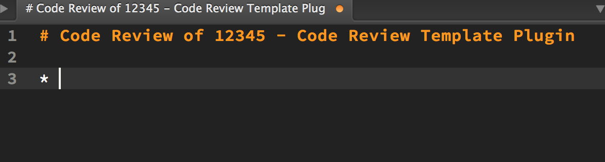

# Code Review Template Sublime Text Plugin

This is a small plugin which adds a new command to create a code review template in Markdown syntax. The command, when activated via the *Command Palette* will prompt you for a PBI number (ticket number) and a title. Once entered a new tab is created with that information filled into the title and the start of a bullet list is made.

### Activating

In Windows or Linux press **CTRL + SHIFT + P**, and OSX press **CMD + SHIFT + P**, to activate the *Command Palette*, then start typing *code review*. As you type the commands available will start to filter and you should see the command **New Code Review**. Press **ENTER** on this command.

Next you will be prompted to enter a PBI #, which is the same as a ticket number. After entering this press **ENTER**. You will then be prompted for a title. This should be a short description of what the ticket is all about. After pressing **ENTER** you will have a new tab that looks like the image below.

### License
The MIT License (MIT)

Copyright (c) 2014 Adam Presley

Permission is hereby granted, free of charge, to any person obtaining a copy
of this software and associated documentation files (the "Software"), to deal
in the Software without restriction, including without limitation the rights
to use, copy, modify, merge, publish, distribute, sublicense, and/or sell
copies of the Software, and to permit persons to whom the Software is
furnished to do so, subject to the following conditions:

The above copyright notice and this permission notice shall be included in all
copies or substantial portions of the Software.

THE SOFTWARE IS PROVIDED "AS IS", WITHOUT WARRANTY OF ANY KIND, EXPRESS OR
IMPLIED, INCLUDING BUT NOT LIMITED TO THE WARRANTIES OF MERCHANTABILITY,
FITNESS FOR A PARTICULAR PURPOSE AND NONINFRINGEMENT. IN NO EVENT SHALL THE
AUTHORS OR COPYRIGHT HOLDERS BE LIABLE FOR ANY CLAIM, DAMAGES OR OTHER
LIABILITY, WHETHER IN AN ACTION OF CONTRACT, TORT OR OTHERWISE, ARISING FROM,
OUT OF OR IN CONNECTION WITH THE SOFTWARE OR THE USE OR OTHER DEALINGS IN THE
SOFTWARE.

